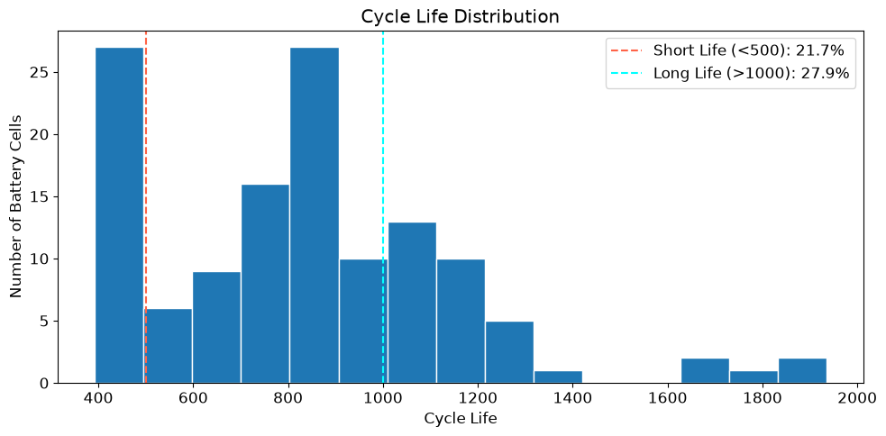
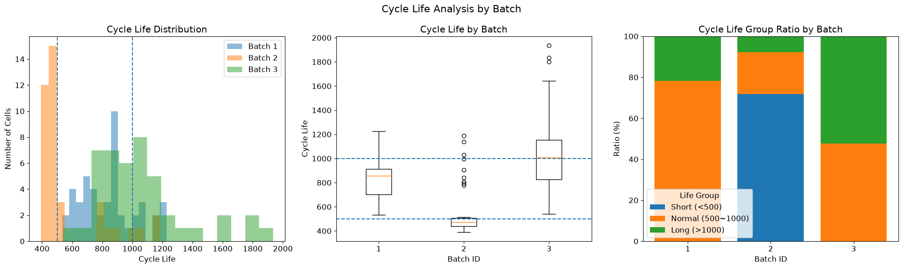
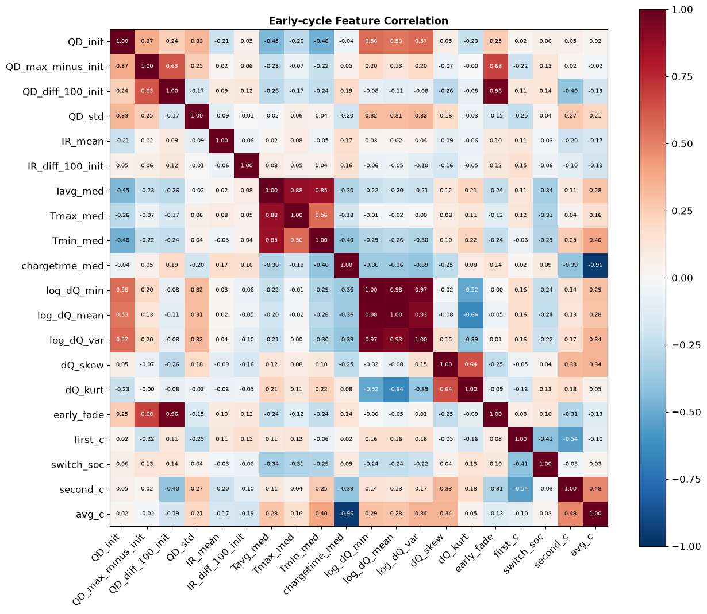

# Day1

## Question

### 1. Cycle Life 분포는 어떻게 생겼는가?

#### 150 ~ 2,300 사이클 Histogram





- Batch별 분포 차이가 큼
    - Batch 1 : 중앙값 859 (534 ~ 1,227), 폭이 좁음
    - Batch 2 : 중앙값 472, 단수명에 집중
    - Batch 3 : 중앙값 1,006 (최대 1,935), 오른쪽 꼬리가 긺
- 전체 분포는 right-skew → 모델링 시 `log10(cycle_life)` 타겟 사용

#### 장수명(>1,000)/단수명(<500) 비율 확인

- Short Life (<500) : **21.7%** (28개)
- Long Life (>1000) : **27.9%** (36개)

#### 이상치 셀 식별 - 왜 유독 짧은가?

- 근거를 발견하지 못 하였다.
- 배치별 unique한 정책들이 존재하기 때문에 정책을 그대로 비교할 수 없다

### 2. 열화 곡선 - 방전 용량이 어떻게 감소하는가?

#### 사이클 별 Qd 추이 시각화


- 초기에는 평탄하다가 후반부에 급격히 하락

#### 열화 속도가 일정한가, 가속되는가?

급격하게 가속된다

#### Knee point - 급격한 열화 시작점 탐색

- 방법 : QD 곡선을 두 직선으로 나눴을 때 SSE가 최소가 되는 cycle (각 구간 최소 50 cycle)
- knee 중앙값 637 cycle
- 수명 대비 위치 : 중앙값 **78%** (IQR 75 ~ 80%) → 수명의 약 3/4 지점에서 급격한 열화
- knee vs cycle_life 상관 r = 0.96 → knee가 늦게 오는 셀이 오래 감
- knee는 초기 100 cycle 안에서 관측되지 않으므로 직접 피쳐로 쓸 수 없다

### 3. ΔQ(V) ****곡선 - 초기 사이클에서 차이가 보이는가?


#### 사이클 100번 - 사이클 10번의 Q(V) 차이 계산

- Qdlin(3.6V → 2.0V, 1,000 point)으로 ΔQ(V) = Q100(V) - Q10(V) 계산 (cycle_life가 있는 129개 셀)
- 거의 모든 셀이 ΔQ < 0 (100 cycle 동안 용량 감소). 차이는 3.2V 부근에서 시작해 2.9 ~ 3.0V 부근에서 가장 크게 벌어짐
- Q2의 QD 곡선에서는 초기 100 cycle 구간이 거의 겹쳐 보였지만, ΔQ(V)에서는 **차이가 뚜렷하게 보임**

#### 장수명 셀 vs 단수명 셀의 ΔQ 형태 비교

- 곡선 모양은 비슷한데 크기가 다름.
- 단수명 vs 장수명 평균
    - dQ_min : -0.0615 vs -0.0202 Ah (약 3배)
    - log10(var) : -3.39 vs -4.37 (분산 약 10배)
    - 2.0V 끝값 : -0.016 vs -0.0034 Ah
- 평균 ± 1 std 밴드가 거의 겹치지 않음 → 100 cycle 시점에 이미 장/단수명 구분 가능

#### 이를 구분할 수 있는 통계값으로 피쳐 추출

- log10(cycle_life)와의 상관계수
    - dQ_min 0.888, log_dQ_var -0.886, log_dQ_min -0.874, dQ_mean 0.861
    - dQ_skew, dQ_kurt는 |r| < 0.33으로 약함
- batch별로도 log_dQ_var 상관 유지 : Batch 1 -0.87 / Batch 2 -0.92 / Batch 3 -0.76 → batch 차이에서 오는 가짜 상관이 아닌 실제 신호
- 대표 피쳐 : log10(var(ΔQ)), 보조 피쳐로 dQ_min

### 4. 충전 조건 (C-rate)과 수명의 관계는?


#### 충전 프로토콜별 평균 수명 비교

- 하위 정책:
    - 3.6C(9%)-5C 395
    - 3.6C(30%)-6C 421
    - 5.6C(26%)-4.5C 449
    - 4.65C(69%)-6C 452
- 상위 정책:
    - 4.8C(80%)-4.8C-newstructure 1,333
    - 4C(80%)-4C 1,227
    - 3.6C(80%)-3.6C 1,182
- 같은 정책도 batch에 따라 수명이 크게 다름
    - 4.8C(80%)-4.8C : Batch1 753 / Batch2 484
    - 4.8C(80%)-4.8C-newstructure : Batch2 872 / Batch3 1,564

#### 고속 충전 셀이 정말 수명이 짧은가?

```python
def avg_c_rate(first_c, switch_soc, second_c):
    """
    0% -> 80% SOC 구간의 평균 C-rate
    - 1단계 : 0% -> switch_soc 를 first_c로 충전
    - 2단계 : switch_soc -> 80% 를 second_c로 충전
    평균 C-rate = 충전량(80%) / 충전 시간
    """
    hours = switch_soc / 100 / first_c + (80 - switch_soc) / 100 / second_c
    return 0.8 / hours
```

- 0 → 80% 평균 C-rate를 계산하면 Batch 2, 3은 모든 정책이 4.79 ~ 4.81C로 같음 (10분 충전 고정) → 고속/저속 비교는 Batch 1에서만 의미가 있음
- Batch 1 : Low(3.6 ~ 4.32C) 평균 987 → Mid 798 → High(4.75 ~ 5.4C) 722
    - 상관계수 -0.737, Low와 High의 평균 수명 차이 약 264 사이클 (중앙값 1,014 vs 720)
    - → 고속 충전 셀의 수명이 짧다
- 다만 평균 C-rate가 같은 Batch 2, 3에서도 수명이 392 ~ 1,935로 다양함 → 총 충전 속도 외에 전류 분배 패턴과 셀/실험 조건의 영향이 큼

#### 충전 전류 패턴과 열화 속도 상관 분석


- 전체 상관계수 : 정책 변수(first_c, switch_soc, second_c, avg_c, early_chargetime) vs early_fade/knee_cycle/cycle_life 모두 |r| ≤ 0.32 → 약함
- batch 안에서 avg_c vs early_fade
    - Batch 1 0.59 → C-rate가 높을수록 초기 용량 감소가 빠름
    - Batch 2, 3은 avg_c가 std 0.005라 batch 내 상관(-0.33, +0.27)은 해석할 수 없음
- 그러나 early_fade(10 ~ 100 cycle QD 기울기) 자체는 수명과 -0.13으로 약함 → 초기 QD 기울기보다 ΔQ(V)가 훨씬 강한 신호
    - → 정책 파라미터는 보조 피쳐로만 사용

### 5. 상관관계 - 어떤 신호가 수명과 연관되어 있는가?


#### 초기 사이클 피켜들과 Cycle Life 상관 계수 확인

- 초기 100 cycle 요약값 + ΔQ 통계 + 충전 정책 변수, 총 20개 피쳐

#### 가장 강한 관계 식별

- log10(var(ΔQ)) : R² ≈ 0.79, 단일 피쳐로 log 수명 분산의 약 79%를 설명. batch별로도 강한 상관 유지
- QD_init(-0.56)은 batch 내부 상관이 0.10 / -0.20 / 0.17로 약함 → Batch 3의 초기 용량이 낮고 수명이 긴 가짜 상관

#### 멀티클리니어리티 문제 확인



- ΔQ 계열은 log_dQ_var 하나만 사용 (필요하면 dQ_min 추가)
- 온도는 Tavg 제외, chargetime_med/avg_c 중 하나, early_fade/QD_diff_100_init 중 하나만 사용
- 또는 Ridge 같은 정규화 선형 모델로 공선성 흡수

## DAY 1 - 모델 설계 전략

### 1. Feature Engineering

모든 피쳐는 초기 100 cycle 이내 데이터만 사용 (cycle 1은 측정 이상치가 많아 제외)

| 구분 | 피쳐 | 근거 |
| --- | --- | --- |
| **핵심** | `log_dQ_var` (log10 var(ΔQ(V))) | 상관계수 -0.89, batch별로도 -0.87 / -0.92 / -0.76으로 유지 (Q3, Q5) |
| **보조** | `dQ_kurt` | 상관 0.32로 약하지만 batch별 부호 일관 (0.27 / 0.65 / 0.34), `log_dQ_var`와 VIF 낮음 |
| **조건부 후보** | `chargetime_med`, `QD_max_minus_init`, `Tmin_med`, `early_fade` | batch마다 상관 부호가 뒤집힘 (예 : `chargetime_med` 0.73 / -0.93 / 0.60) → 모델 성능이 실제로 좋아질 때만 채택 |
| **제외** | `log_dQ_min`, `log_dQ_mean` | `log_dQ_var`와 r 0.93 ~ 0.98, VIF 277 ~ 372 (Q5) |
|  | `QD_init` | 전체 상관 -0.56은 batch 간 차이에서 생긴 가짜 상관, batch 내부 0.10 / -0.20 / 0.17 (Q5) |
|  | `Tavg_med`, `Tmax_med` | `Tmin_med`와 공선성 (r 0.85 ~ 0.88), 상관 약함 |
|  | `QD_diff_100_init` | `early_fade`와 r 0.96 |
|  | `IR_mean`, `IR_diff_100_init` | 수명과 상관 거의 0 (EDA 3, Q5) |
|  | `first_c`, `switch_soc`, `second_c`, `avg_c` | 정책이 batch마다 다르고, Batch 2, 3은 `avg_c`가 상수 (Q4) → 새 batch에 일반화 어려움 |
|  | `knee_cycle` | 수명의 약 78% 지점에서 관측 → 초기 100 cycle 안에서 알 수 없음 (Q2, leakage) |

## 2. Regression 선택 및 Target Variable

- 방법 : **Regression**
    - 수명을 사이클 수로 직접 예측하면 장/단수명 구분(classification)도 함께 할 수 있음
    - 핵심 피쳐 log_dQ_var와 수명의 관계가 선형에 가까움 (단일 피쳐 R² ≈ 0.79)
- Target : **log10(cycle_life)**
    - cycle_life는 right-skew (skew 0.90, Batch 3의 1,500 ~ 1,935 꼬리) → log 변환 후 skew -0.09
    - ΔQ 피쳐를 log 스케일로 쓸 때 수명과 선형 관계가 됨
    - 예측값은 10 ** pred로 되돌려 사이클 단위로 평가

## 3. Modeling Strategy

### 데이터 처리

- 대상 : Batch 1 ~ 3 중 cycle_life가 있는 129개 셀 (EOL 미도달 10개 제외)
- 셀 수가 129개로 적음 → 피쳐 수를 2 ~ 6개로 제한하여 과적합 방지
- 스케일링 : StandardScaler

### 후보 모델

| 단계 | 모델 | 피쳐 | 목적 |
| --- | --- | --- | --- |
| 주 모델 | Ridge | 핵심 + 보조 (+ 조건부 후보) | 셀 수가 적고 공선성이 있어 |
| 비교 | Random Forest / Gradient Boosting | 동일 | 비선형 관계 확인, 다만 n = 129라 과적합 여부를 CV로 확인 |
| Baseline | Linear Regression | log_dQ_var | 단일 핵심 피쳐 성능 (논문의 variance model) |
- 피쳐 세트 비교 : log_dQ_var → + dQ_kurt → + 조건부 후보 순서로 추가하며 CV 오차가 줄어드는 경우만 채택

### 평가

- RMSE (cycle), MAPE (%) : 예측값을 사이클 단위로 되돌려 계산
- 잔차 분석 : batch별, 수명 구간별 (장수명 셀일수록 예측이 어려울 것으로 예상, EDA 1)